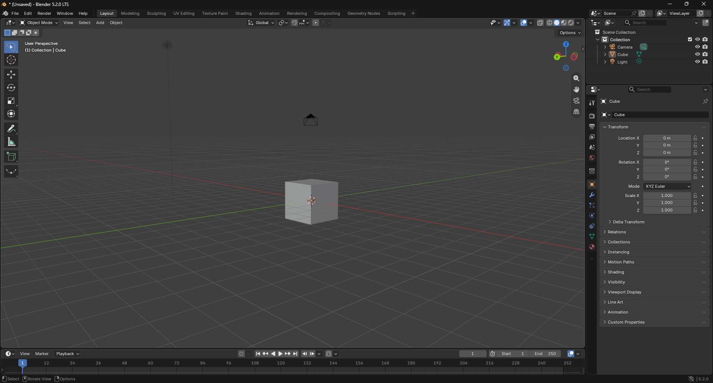

## Chapter 1 - Basic shortcuts and learning the Interface
When you open up Blender, you just spawn with a cube and nothing else.

### Beginner Shortcuts

    LMB (Left Click) — Select an object
    RMB (Right Click) — Opens up the options menu
    MMB (Middle Click) + Drag — Moving the viewport around the object
    MMB (Middle Click) + Shift + Drag — Moving the viewpoint across the scene
    G — Move the object
    R — Rotate the object
    S — Scale the object
    X — Delete the object (with an additional confirmation)
    Del — Delete the object (with no additional confirmation)
    Shift + A — Opens the Add Menu to insert new objects
    Ctrl + Z — Undo the previous action
    . (Numpad) — Center your viewport on the selected object
    Tab — Toggle between Edit Mode and Object Mode
    H — Hide the selected object
    Alt + H — Unhide every object that was hided before
    Z — Opens the Shading Pie Menu
    Ctrl + J + *selected objects* — Joins multiple selected objects into a single mesh
    Ctrl + 0/1/2/3/4/5 (Numpad) — Applies Subdivision Surface Modifier (smoothing) with level 0-5.

    